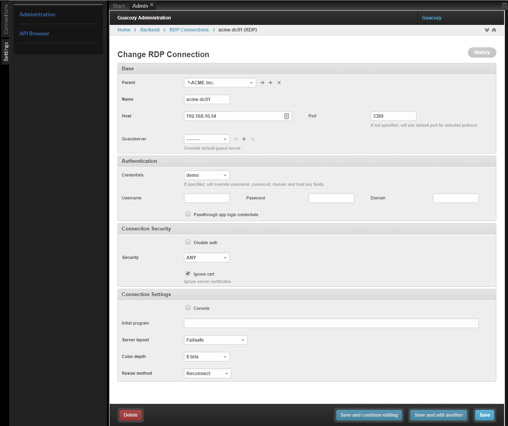

_**Connection**_ object describes a VNC/RDP/SSH connection.  
_**Connections**_ live in a Folder

#### Options
You can specify most of connection options allowed by Apache Guacamole™ protocol 
([read more about options](https://guacamole.apache.org/doc/gug/configuring-guacamole.html#connection-configuration))

_**Connection**_ options/credentials are never exposed to application user, who doesn't have staff permission level and access to _**Connection**_ objects.    
 
#### Permissions
You cannot specify permissions at connection level, only folder-level permissions are implemented.   

#### Connection credentials
You can specify **username, domain, password, private key, passphrase** directly in connection object.   

You can reference a **Static Credentials** object if this connection uses a password shared with other servers.  

You can reference a **Named Credentials** object if every user should have own credentials to this connection (**Personal Named Credentials**) 

#### Screenshot

