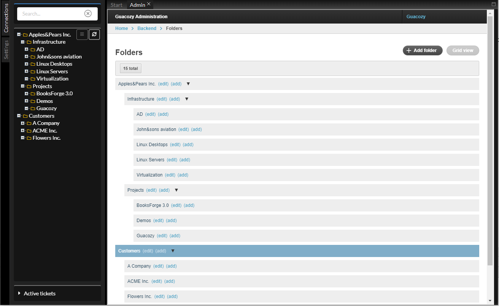

Folders are used to hierarchically organize connections and as permission containers.

Folders have no limit of nesting levels.

If a permission is granted to access a folder - it automatically allows access for all connections inside it and all descendant folders.

#### Screenshots

