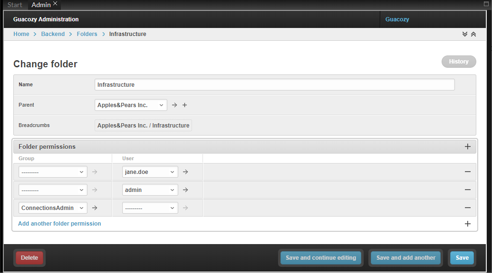

For most objects you can use default Django permission model (Django doesn't have object-level permissions)
#### Personal Named Credentials
_**Personal Named Credentials**_ are by definition _personal_, so strict checking on ony operation is implemented in Admin interface.  
Only the owner can add/view/delete _**Personal Named Credentials**_. 

Admin can see the fact that a user has a _**Personal Named Credentials**_ object referring a _**Named Credentials**_

#### Folders & Connections
_**Folders**_ and _**Connections**_ when used over REST API implement folders permissions.  

Permissions can be granted on Folder level (implemented using Folder Permission object)    
Permissions can be granted to user groups or individual folder.  

Permissions granted on a folder give access to this folder and all subfolders.

##### API endpoints

Endpoints which implement folder permission logic:  

`folders` - flat list of of folders available to current user  
`folders/tree` - hierarchical list of folders available to current user  
`connections` - flat list of folders and connections  and folders required to view connections
`connections/tree` - hierarchical list of connections in folders 

##### Folders Ancestors
API result include not only folders which available to current user, but also all ancestors from root folder. 
Connections and subfolders from other folders will not be included.

Example folder structure:  
```
Root foler
  ┝ Customer A
  ┝ Customer B
  ┕ Customer C
    ┝ Servers
    ┝ Network
    ┕ Printers
```
If access is given only to `Printers` folder, the result will be
```
Root foler
  ┕ Customer C
    ┕ Printers
```


 
 
 