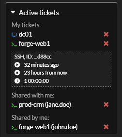

_**Ticket**_ object is a method to allow and log time limited access to a _**Connection**_.

_**Ticket**_ references a _**Connection**_ and has a time limit, defined by time when ticket was created and it's validity period.

_**Tickets**_ with expired validity are deleted automatically. 

Each _**Ticket**_ has an **Author** (who _created_ a ticket) and **User** (who can _use_ a ticket).

#### Sharing
User can _share_ a _**Ticket**_ with another user. In this case tickets share **guacd session** which means 
they see the same view and if control is allowed - use session simultaneously. 
[Read more about ticket sharing](../features/ticket-sharing.md)

#### Screenshot
