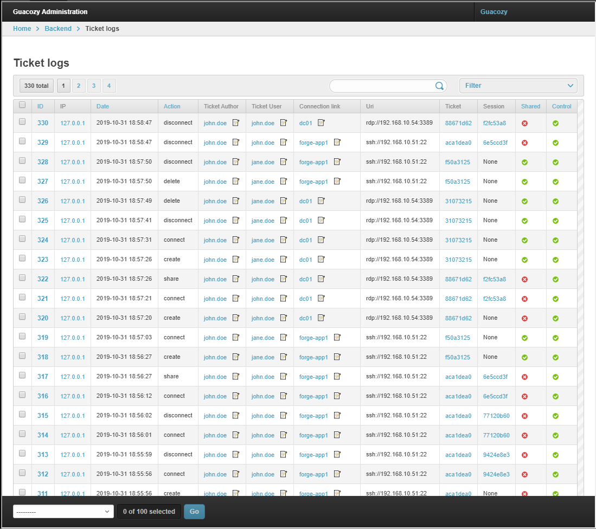

Audit log contains ticket actions, because any usage of connection is possible only using a ticket.

#### Actions logged:
* Connect
* Create
* Delete 
* Disconnect
* Duplicate
* Share

#### Screenshot  

