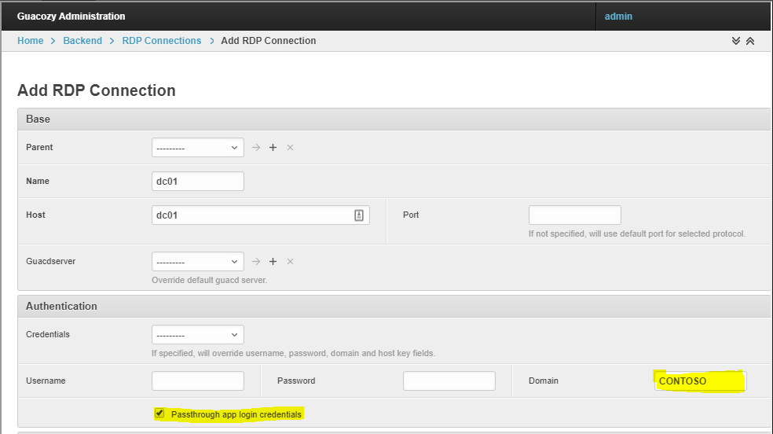

Credentials passthrough setting allows to reuse username/password which user used to login to guacozy for remote connection.

This is useful if user logs in to Guacozy using LDAP and then logs in to servers which accept same login/password.

For security purposes username/password is never save to persistent storage or transferred via network.  
On login username and password are saved to Django session, and Django session engine is local memcached (running inside same container), accessed via sock file

If a connection needs domain name in credentials, please specify it in Connection.   

### Example

