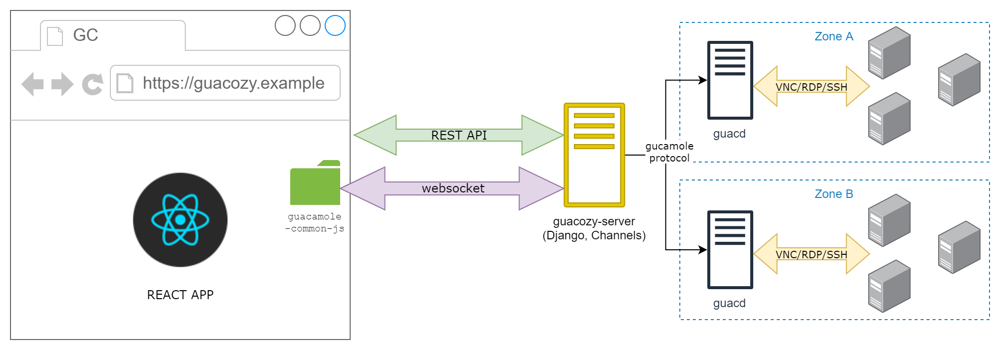

# Introduction
[GitHub](https://github.com/paidem/guacozy) [DockerHub](https://hub.docker.com/r/guacozy/guacozy-server)
___
### What is guacozy
Guacozy is a HTML5 browser based VNC/RDP/SSH remote access solution based on [Apache Guacamole™](https://guacamole.apache.org/) technology
___
### Why was it created
I manage several hundreds of connections (servers, virtual machines, network equipment) which are
both internal and external (tens of customers).   

Often I need possibility to quickly jump in, do some quick job/fix/diagnostics, and jump out.
  
For years I was using a great application called [Royal TS](https://www.royalapps.com/ts/win/features), 
but wished more collaboration features and access from web interface.   

I liked the idea/technology of Apache Guacamole™, but was not pleased with it's aesthetics (mostly connection grouping/selection/management)

So I decided to build a tool for internal use base on the guacamole technology, but using Django for administration part and React for frontend.  
___
### Who needs it
This application was designed for some specific use cases:
##### Case #1: Daily sysadmin remote access to servers
Have tens/hundreds of connections in a tree view, quickly find, connect, to some work, logout.  
Have log of connections. 
##### Case #2: Give programmers access to servers
Have many dev/prod/support environments and give access to employees to certain
environments based on project/group/seniority.  
Give employee access to connection without sharing credentials to server/equipment.
Limit visibility of available connections while still rendering connection tree.    
Have log of connections. 
##### Case #3: Access for contractors/customers
Allow contractor or customer to connect without using VPN, NAT.  
For example demo a product in a controlled environment.  
Have log of connections. 

##### Case #4: Collaborative access
Connect to server and give another person time limited access to you connection at any moment during connection.  
Specify if another person should have ability to send input (keyboard/mouse) or is just a viewer.  
Revoke access at any moment.  
 
___
### How much of original Apache Guacamole™ technology is used
All the heavylifting (making connections to VNC/RDP/SSH servers, encoding data and renderting it in frontend) is done by original Apache Guacamole™ technology  
###### Apache Guacamole™ components used: 
 * frontend Guacamole protocol implementation (websocket, rendering, keyboard/mouse) - [gucamole-common-js](https://github.com/apache/guacamole-client/tree/master/guacamole-common-js)
 * server-side proxy - [guacd](https://github.com/apache/guacamole-server/tree/master/src/guacd)
 
___
### Guacozy architecture

